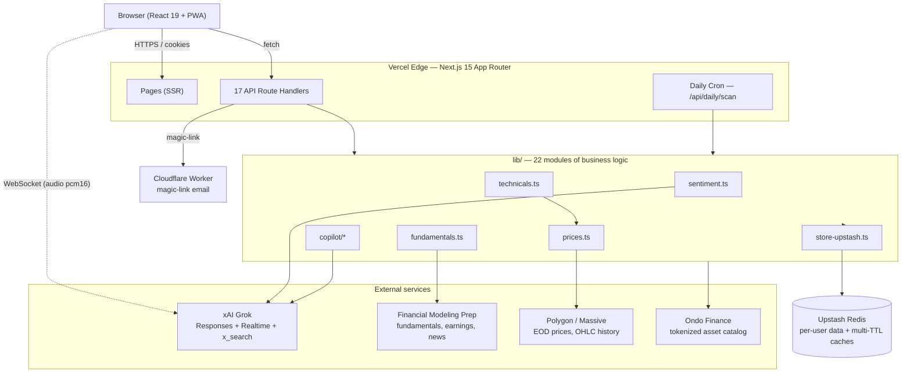
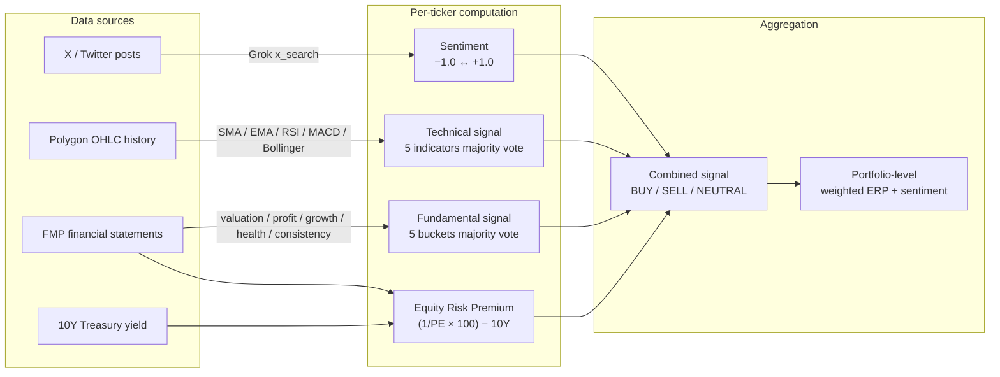
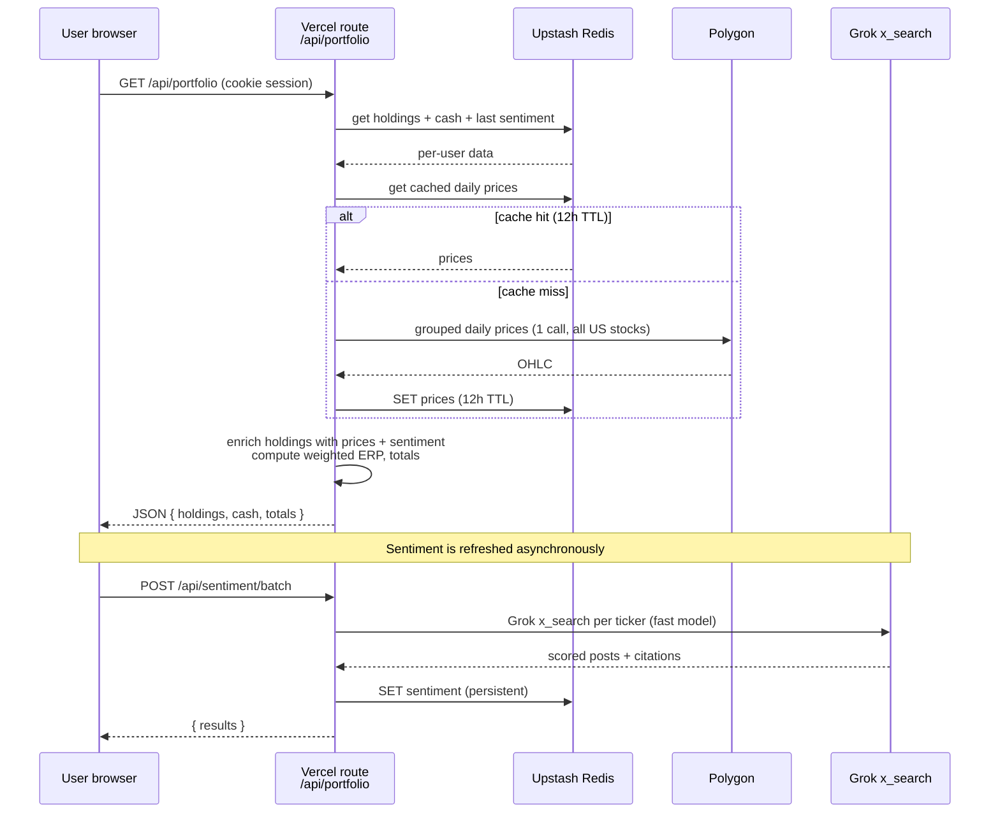
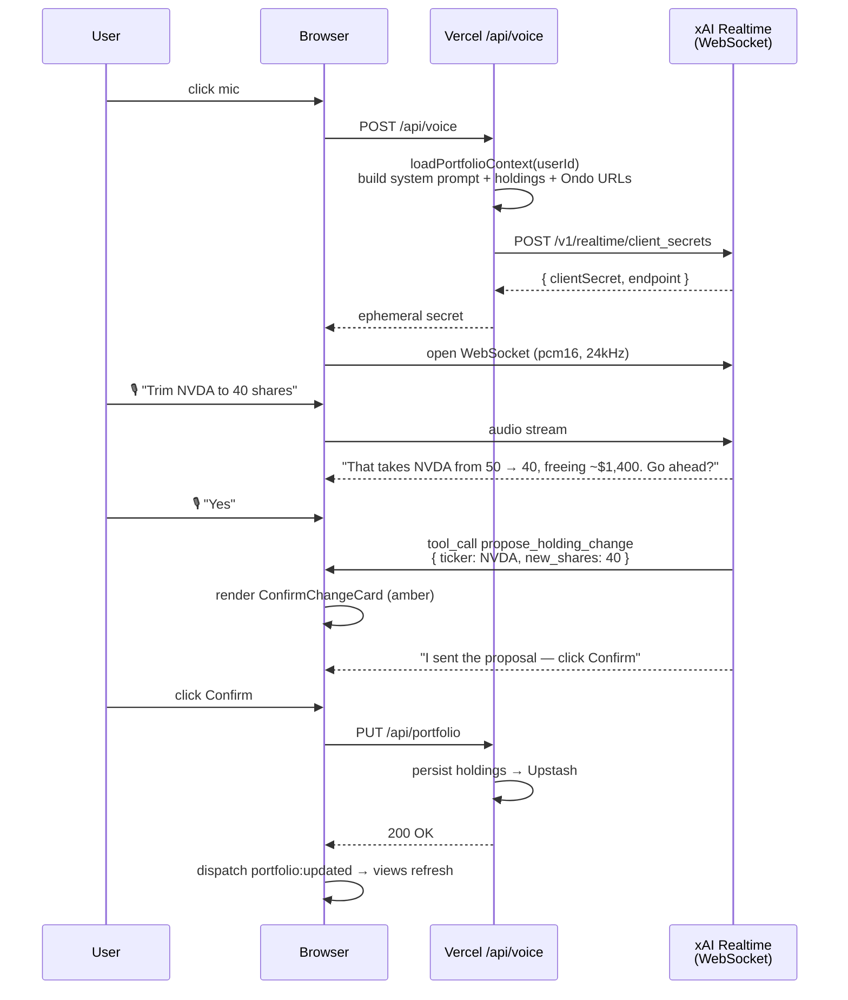
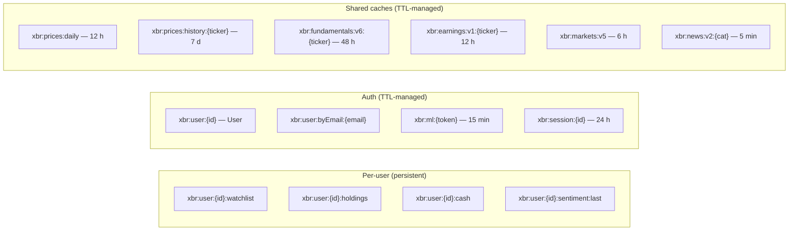

# xBullRadar

> **The AI-native Bloomberg terminal for the next generation of investors.**
>
> Multi-signal stock analytics, real-time X sentiment, conversational AI with
> investment-school voice personas, voice-activated portfolio rebalancing, and
> tokenized trading via Ondo Finance — in a single web app that costs ~$100/mo
> to run instead of $24,000/yr per seat.

[**Live app**](https://app.xbullradar.com) ·
[**Investor pitch deck (PDF, with screenshots)**](https://app.xbullradar.com/investors/xBullRadar-Pitch-Deck.pdf) ·
[**Architecture deep-dive**](./ARCHITECTURE.md)

---

## What it does

xBullRadar layers **four independent analytical signals** on every ticker in
your portfolio and watchlist, then combines them into a single actionable
verdict:

| Signal | Source | Method |
|---|---|---|
| **Sentiment** | X (Twitter) via Grok `x_search` | Real-time social chatter scored −1.0 to +1.0 |
| **Technical** | Polygon historical OHLC | SMA / EMA / RSI / MACD / Bollinger majority vote |
| **Fundamental** | FMP financial statements | Valuation / profitability / growth / health / consistency |
| **Equity Risk Premium** | FMP P/E + 10Y treasury yield | Earnings yield minus risk-free rate |

A conversational AI co-pilot (text + voice) powered by **xAI Grok** can read
your actual holdings, switch between investment philosophies (Buffett, Lynch,
ARK, quant), and execute portfolio rebalancing through a two-stage commit
pattern (bot proposes, you confirm).

Trading is facilitated through **Ondo Finance**, which tokenizes US stocks as
on-chain assets — 263 tickers available as of April 2026.

---

## System architecture



**Key architectural decisions:**

1. **Single Next.js app** — no microservices, no separate API server. Route
   Handlers call external APIs directly. Easier to deploy, debug, and iterate
   on during the trial phase.
2. **Upstash REST Redis** — no connection pooling needed. Talks HTTPS, works
   on any serverless host. Per-user data keyed by `userId`; shared caches
   (prices, markets, news) are global.
3. **Browser-direct voice** — the Vercel route only mints an ephemeral xAI
   secret. All audio streaming happens over a WebSocket between the browser
   and `wss://api.x.ai/v1/realtime`. Minimizes latency, keeps the server
   stateless.
4. **Cache-first** — every external API call goes through an Upstash cache
   with a tuned TTL. A nightly Vercel cron warms all caches proactively so
   morning users never hit cold fetches.

---

## Signal pipeline

How a single ticker turns into a `BUY` / `SELL` / `NEUTRAL` verdict:



Each layer is intentionally independent so divergence is visible — a stock
with bullish fundamentals but bearish sentiment surfaces as a clear yellow
flag, not a smoothed-out average.

---

## Data flow — a single request



---

## Voice rebalancing — two-stage commit

The voice agent never directly mutates portfolio state. Verbal consent +
physical click prevents phantom trades from LLM confabulation.



---

## Data sources & cost

| Service | What it provides | Tier | Cost |
|---|---|---|---|
| **xAI Grok** | Sentiment scoring (`x_search`), conversational AI (Responses API), voice agent (Realtime API) | Paid | ~$50–100/mo at trial scale |
| **Financial Modeling Prep** | Fundamentals (P/E, ROE, margins), earnings calendar, treasury yields, commodities, exchange hours, news (4 categories) | Stocks Starter | $14/mo |
| **Polygon / Massive** | End-of-day OHLC prices, historical closes for technicals | Stocks Basic | Free |
| **Ondo Finance** | 263 tokenized stock/ETF tickers, deep-link trading URLs | Static catalog | Free |
| **Upstash Redis** | Production persistence + multi-TTL caching | Pay-as-you-go | ~$10–20/mo |
| **Vercel** | Hosting, CDN, serverless functions, cron | Pro | ~$20/mo |
| **Cloudflare Workers** | Magic-link email delivery via M365 Graph API | Custom | Included |

**Total infrastructure: ~$95–155/mo** at trial scale. Per-user cost projects to
**$4–7/mo at 100 users**.

---

## Tech stack

| Layer | Technology |
|---|---|
| Framework | Next.js 15 (App Router) |
| UI | React 19 + Tailwind CSS 4 + Radix primitives + Lucide icons |
| Language | TypeScript 5.7 (strict) |
| AI / LLM | xAI Grok — `grok-4.20-reasoning` (deep), `grok-4-1-fast-reasoning` (batch) |
| Voice | xAI Realtime API (WebSocket, pcm16 @ 24 kHz) |
| Storage | Upstash Redis (REST API) |
| PWA | Serwist 9 service worker |
| Hosting | Vercel (edge + cron) |
| Auth | Magic-link, allowlist-gated, M365 Graph via Cloudflare Worker |

**Zero external chart libraries.** All signal badges, the ticker tape, the
portfolio table, and the voice transcript are custom Tailwind components.

Codebase: ~11,800 lines of TypeScript across 22 lib modules, 20 React
components, 17 API routes.

---

## API surface

| Route | Method | Purpose |
|---|---|---|
| `/api/auth/request` | POST | Send magic-link email |
| `/auth/verify` | GET | Consume magic-link → create session |
| `/api/auth/signout` | POST | Revoke session |
| `/api/portfolio` | GET / PUT | Enriched holdings + cash + totals |
| `/api/watchlist` | GET / PUT | User's watchlist |
| `/api/sentiment/batch` | GET / POST | Last-known scores / re-score via Grok |
| `/api/technicals` | GET | Per-ticker technical signal |
| `/api/fundamentals` | GET | Per-ticker fundamental signal |
| `/api/earnings` | GET | Next earnings + beat history |
| `/api/markets` | GET | Commodities, exchanges, treasury yields |
| `/api/news` | GET | News by category |
| `/api/copilot` | POST | Conversational AI (text) |
| `/api/voice` | POST | Mint xAI Realtime ephemeral secret |
| `/api/daily/scan` | POST | Nightly cron — warm caches + batch scan |

All user-facing routes require a session cookie. The cron route is
authenticated via `Authorization: Bearer ${CRON_SECRET}` (Vercel injects this
automatically).

---

## Cache layout



Cache keys carry a **version suffix** (`v5`, `v6`…) that bumps whenever the
cached shape changes — instant invalidation on deploy without migration
scripts. Stale entries are simply ignored and garbage-collected by their
natural TTL.

---

## Getting started

### Prerequisites

- Node.js ≥ 20
- An xAI API key (Grok)
- An FMP API key (Stocks Starter tier)
- A Polygon API key (Stocks Basic free tier is enough)
- An Upstash Redis instance (or skip for local-only `data/store.json`)

### Local development

```bash
git clone https://github.com/cintelis/xbullradar.git
cd xbullradar
npm install
cp .env.example .env   # then fill in the keys below
npm run dev
```

### Required environment variables

```bash
XAI_API_KEY=...                    # xAI Grok
FMP_API_KEY=...                    # Financial Modeling Prep
POLYGON_API_KEY=...                # Polygon / Massive
UPSTASH_REDIS_REST_URL=...         # Upstash Redis REST endpoint
UPSTASH_REDIS_REST_TOKEN=...
CRON_SECRET=...                    # Bearer token for /api/daily/scan
CF_ACCESS_CLIENT_ID=...            # magic-link email worker
CF_ACCESS_CLIENT_SECRET=...
```

### Optional

```bash
ALLOWED_EMAILS=alice@x.com,bob@y.com   # trial allowlist (open if unset)
GROK_MODEL=grok-4.20-reasoning         # deep model
GROK_MODEL_FAST=grok-4-1-fast-reasoning # batch model
ALERT_WEBHOOK_URL=...                  # Slack/Discord sentiment alerts
BULLISH_THRESHOLD=0.5
BEARISH_THRESHOLD=-0.5
SESSION_TTL_HOURS=24
```

The full env reference lives in [`AGENTS.md`](./AGENTS.md).

### Scripts

```bash
npm run dev         # next dev
npm run build       # next build
npm run start       # next start
npm run typecheck   # tsc --noEmit
npm run lint        # next lint
```

---

## Roadmap

The trial v1 ships everything in the **Shipped** column of
[`ARCHITECTURE.md`](./ARCHITECTURE.md#whats-built-vs-whats-next). Highlights of
what's next:

| Phase | Focus | Examples |
|---|---|---|
| **Phase 1 (now)** | Intelligence layer | X breaking news in chat, server-side chat history, mobile voice polish |
| **Phase 2 (May–Jun)** | Analytics & screening | Stock screener (filter by signal combo), economic calendar, portfolio analytics, multi-portfolio |
| **Phase 3 (Jul–Aug)** | Market coverage | International stocks (ASX, LSE, HKEX), options chain, fixed-income analytics, on-chain crypto metrics |
| **Phase 4 (Q4)** | Platform | Brokerage integration (Plaid → Schwab/Fidelity/IBKR), drag-and-drop dashboard layouts, API access, backtesting |

---

## The Bloomberg comparison

| Dimension | Bloomberg Terminal | xBullRadar |
|---|---|---|
| **Price** | $24,000/yr/seat | ~$100/mo to run (infra) |
| **AI** | Bolted-on GPT wrapper | AI-native: Grok co-pilot, voice personas, portfolio-aware reasoning, voice rebalancing |
| **Social sentiment** | News wire + limited Twitter | Real-time X scoring via `x_search`, grounded in actual posts with citations |
| **Voice** | None | Built-in voice agent — ask, analyze, execute, hands-free |
| **Trading** | EMSX (institutional) | Ondo Finance (tokenized, on-chain, retail-accessible) |
| **Signals** | Raw data — user does the analysis | Pre-computed multi-signal verdicts: technical + fundamental + sentiment + ERP |
| **Deployment** | Dedicated hardware + network | Any browser, any device, Vercel edge |

The honest gap: Bloomberg has 40 years of data depth, microsecond-latency
exchange feeds, and the network effect of 350,000 terminal users on Bloomberg
MSG. We don't compete on those — we compete on **intelligence, accessibility,
cost, and the AI-native experience** that a 1980s architecture can't retrofit.

---

## License

Proprietary — © Cintelis. All rights reserved.

For investor inquiries, see the [pitch deck](https://app.xbullradar.com/investors/xBullRadar-Pitch-Deck.pdf)
or reach out to the team.
